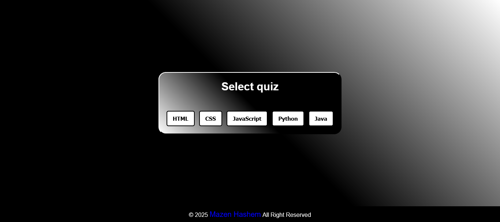
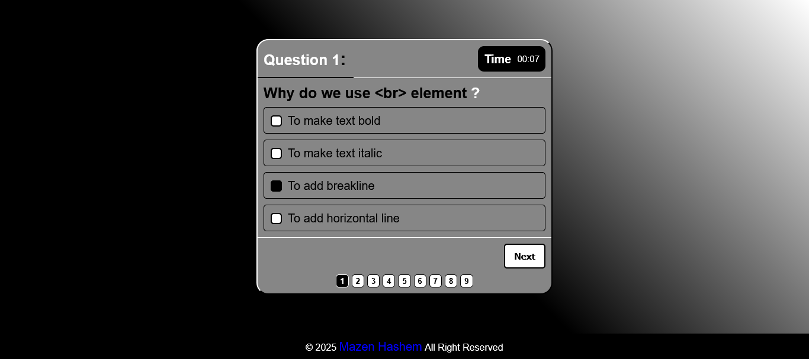
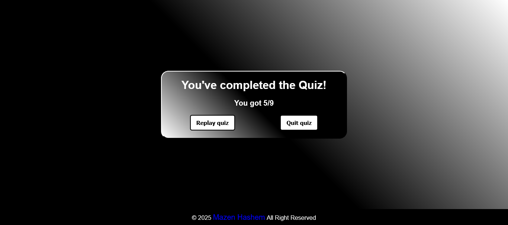

<h1>Quiz App</h1>

  

<h2>Description</h2>

  This is a Quiz App made by 
  <em>HTML</em> , 
  <em>CSS</em> and
  <em>JavaScript</em> languages.
  Inspired by 
  <strong>
    <a href="https://www.youtube.com/@ElzeroWebSchool">ElzeroWebSchool</a>
  </strong> 
  channel.

My goal from this project is to show my experience in Front-end web development.

<h3><u>Functionality:</u></h3>
<h4>On click quiz buttons:-</h4>
<ul>
  <li>It will fetch clicked button's data from local json file.</li>
  <li>Quiz will create depends on number of questions and answers.</li>
</ul>
<h4>Quiz:-</h4>
<ul>
  <li>You will know the number of questions when start the quiz.</li>
  <li>You have 10 seconds to answer each question, if times up it will turn to the next question.</li>
  <li>You will get 1 point for each correct answer. At the end of the Quiz, your total score will be displayed.</li>
  <li>You can replay the quiz by click replay quiz button or quit it by quit quiz button.</li>
</ul>

<h3><u>Responsiveness:</u></h3>

  The website is responsive, it created to use across all devices, such as modern desktops, tablets, and phone browsers.

<h2>Screenshot</h2>
<h3><u>Start:</u></h3>

<h3><u>Quiz box:</u></h3>

<h3><u>Result:</u></h3>
